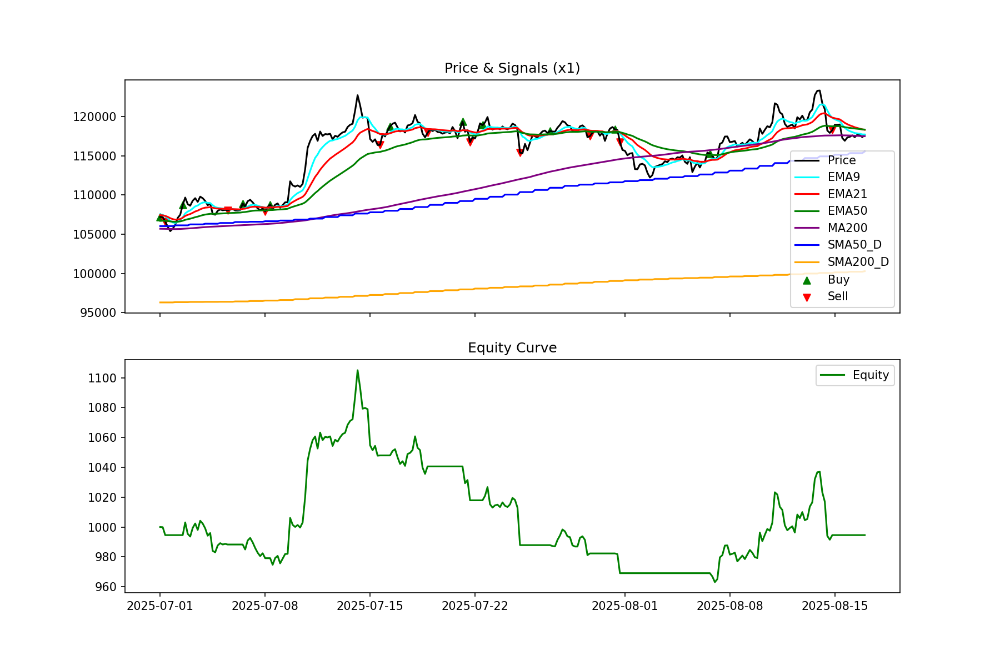

# TradingTester 

TradingTester 是一個專業的 **加密貨幣交易策略回測框架**，使用 Python 開發，提供靈活的策略設計與回測功能，適合用於研究與驗證不同的交易策略。


---

## 功能特色
- **策略模組化**  
  - 不同策略獨立於 `strategies/`，方便擴充與維護。
- **資料擷取**  
  - 使用 [ccxt](https://github.com/ccxt/ccxt) 從 OKX 取得歷史 K 線資料。
- **技術指標支援**  
  - 內建 SMA、EMA、RSI 等常見技術分析工具。
- **回測系統**  
  - 資金曲線（Equity Curve）
  - 買賣訊號可視化
  - 總報酬率、最大回撤、交易次數統計
- **結果輸出**  
  - 自動輸出回測圖表至 `results/`  
  - 檔名格式：  
    ```
    <main檔案名>_<開始日期>_<結束日期>.png
    ```
    例如：`BTC_1x_sma_20250701_20250801.png`

---

## 專案結構
```
TradingTester/
├── mains/             # 各種策略的執行入口
│   ├── BTC_1x_sma.py
│   ├── BTC_1x_trend.py
│   └── ... (更多策略)
│
├── backtester/        # 回測核心
│   └── core.py
│
├── strategies/        # 策略模組
│   ├── base.py
│   ├── sma.py
│   └── trend_multi.py
│
├── utils/             # 工具
│   └── data_loader.py
│
├── results/           # 回測結果 (自動生成，已 gitignore)
│
├── docs/              # 說明文件與展示圖
│   └── images/
│       └── sample_backtest.png
│
└── venv/              # Python 虛擬環境 (已 gitignore)
```

---

## 使用方式

1. **建立虛擬環境並安裝套件**
   ```bash
   git clone https://github.com/bine0619/TradingTester.git
   cd TradingTester

   python -m venv venv
   source venv/bin/activate   # Linux / macOS
   venv\Scripts\activate      # Windows

   pip install -r requirements.txt
   ```

2. **執行回測**
   ```bash
   python mains/BTC_1x_sma.py
   ```
   或
   ```bash
   python mains/BTC_1x_trend.py
   ```

3. **查看結果**
   - 終端機會輸出回測統計資訊  
   - `results/` 資料夾會生成對應圖檔  

---

## 範例結果
以下為 SMA 策略的回測結果範例：

<p align="center">
  
</p>

---

## Roadmap
- [ ] 增加更多策略（MACD、Bollinger Bands）
- [ ] 支援多幣種回測
- [ ] 優化績效報表輸出
- [ ] 加入單元測試與 CI/CD

---

## 作者
- [bine0619](https://github.com/bine0619)

---

## License
This project is licensed under the MIT License - see the [LICENSE](LICENSE) file for details.
